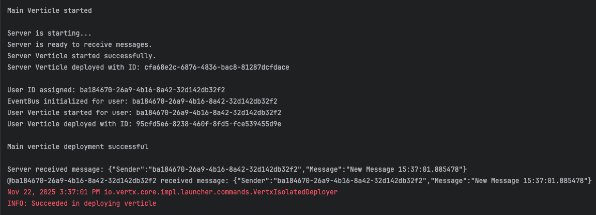

# VertexChatApp

- Lightweight Vert\.x chat example using Maven and Java\. Demonstrates a client-style `UserVerticle` that registers an eventbus consumer and sends JSON messages to a `SERVER` verticle.
- It demonstrates how different verticles communicate using the Vert.x Event bus.

## Requirements:

- Java 17\+
- Maven 3\.6\+

## Run using command:

- compile and run via exec-maven-plugin as configured above
- `mvn clean compile exec:java`

## Run using IntelliJ:

- Create a new Run Configuration -> Application.
- Main class: io.vertx.core.Launcher
- Program arguments: run org.example.MainVerticle
- Use project classpath/module and Run.

## Expected lifecycle:

- The application deploys verticles which print startup logs and use the Vert.x EventBus.

## What UserVerticle does:

- Generates a unique user id (UUID) on start.
- Initializes the Vert.x EventBus.
- Registers a consumer on address USER_RECEIVE to print incoming messages.
- Sends a JSON message to address SERVER_PROPAGATION_TOPIC with keys Sender and Message.

## Output example:

## Addresses used:

- USER_RECEIVE — verticle receives messages here.
- SERVER_PROPAGATION_TOPIC — messages are sent to this address.
  
